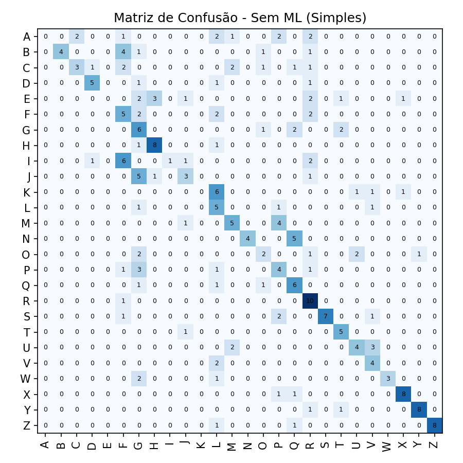
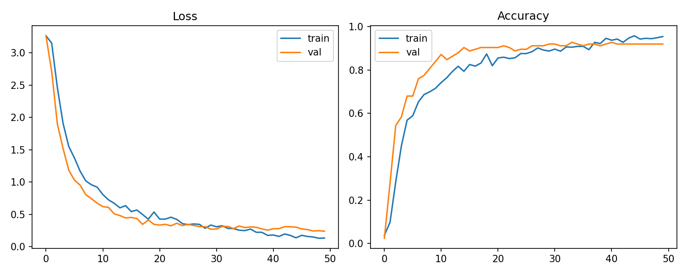
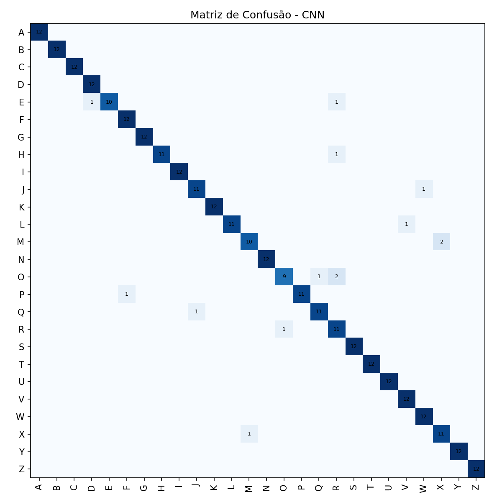
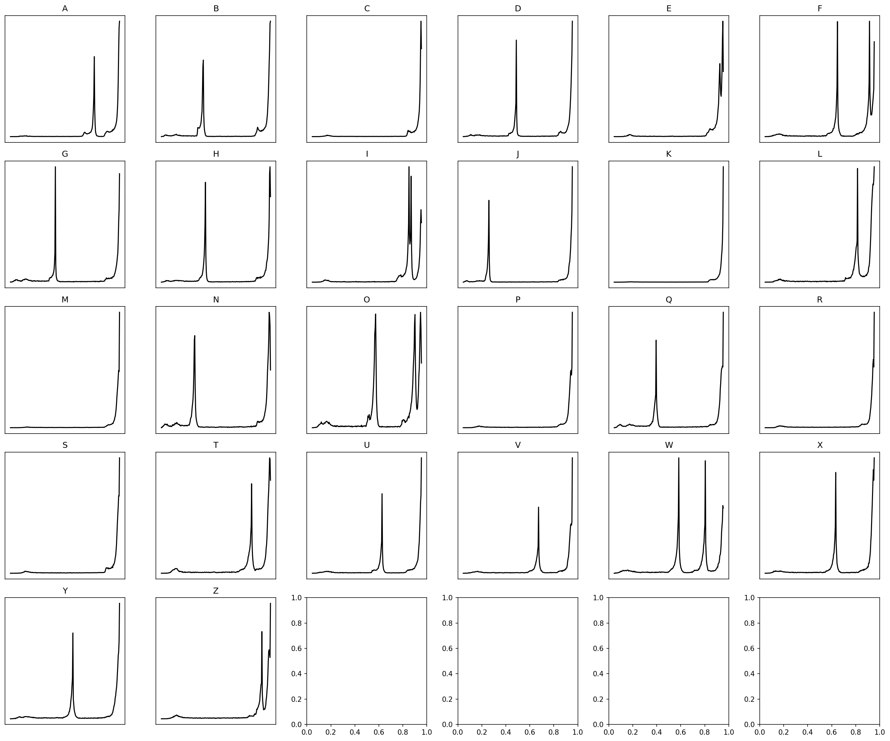

# Relatório de Comparação – Reconhecimento de Braille (A–E)

Data: 29/11/2025  
Autores: *Bernardo Vannier* e *André  Goedert*

---
## Objetivo
Comparar duas abordagens para classificação de caracteres Braille (A–Z) conforme requisitos da disciplina:
1. Pré-processar imagens com filtros relevantes (OpenCV).
2. Implementar método sem aprendizado de máquina (histograma acumulativo + lógica de matriz Braille) from scratch.
3. Implementar método com aprendizado de máquina (CNN).
4. Avaliar ambos: acurácia, matriz de confusão e curvas de treinamento.
5. Disponibilizar inferência via webcam para os dois métodos.

---
## A. Pré-processamento
Pipeline padronizado (`src/preprocessing/pipeline.py`):
- Grayscale → GaussianBlur (5x5) → Equalização de histograma → Fechamento morfológico (elipse 3x3) → (Opcional) detecção simples de ROI por maior contorno → Redimensionamento.
- Para método sem ML: saída binária (Otsu) para facilitar detecção de pontos.
- Para CNN: saída grayscale equalizada normalizada em [0,1].

### Exemplos
Arquivos gerados em `results/preprocessing/` (demo_binary.png, demo_gray.png).

---
## B. Método Sem Aprendizado de Máquina
Arquivo principal simples: `src/classification_no_ml/simple_braille.py` (treino/teste) e `infer_no_ml.py` (webcam). Estratégia:
1. Divisão da imagem binária em grade 3x2 (padrão Braille).
2. Para cada célula: histograma acumulativo manual → proporção de pixels com intensidade ≥ 200 → score.
3. Threshold adaptativo (média * 0.85, mínimo 0.15) para decidir dot ativo.
4. Conversão em matriz 3x2 e comparação com dicionário Braille from scratch.

### Resultado
- Acurácia teste: **37.82%** (arquivo `results/no_ml/simple/summary.txt`).
- Matriz de confusão: `results/no_ml/simple/confusion_matrix_simple.png`.



### Observação
Baixa acurácia esperada: método heurístico não aprende nuances de iluminação/variação de formato. Serve como baseline pedagógico.

---
## C. Método Com Aprendizado de Máquina (CNN)
Arquivo: `src/classification_cnn/train_cnn.py` (variante `lenet`). Características:
- Augmentação: rotação pequena, zoom, contraste (`layers.RandomRotation/Zoom/Contrast`).
- Camadas: Conv(32) → MaxPool → Conv(64) → MaxPool → Conv(128) → MaxPool → Flatten → Dense(256, Dropout 0.5) → Softmax (26 classes).
- Otimização: Adam (1e-3), ReduceLROnPlateau, EarlyStopping.
- 80/20 split estratificado.

### Resultado
- Acurácia teste: **95.51%** (arquivo `results/cnn/metrics.txt`).
- Matriz de confusão: `results/cnn/confusion_matrix_cnn.png`.
- Curvas treinamento: `results/cnn/training_curves.png`.




### Análise Breve
- Overfitting mitigado com augmentação (val_accuracy ~92%).
- Letras com menor recall (ex: O, R) apresentam confusões pontuais provavelmente por similaridade de padrões de dots.

---
## D. Comparação Quantitativa
| Método        | Acurácia Teste | Observações Principais |
|---------------|----------------|------------------------|
| Sem ML (Hist+Matriz) | 37.82% | Sensível a variação de contraste; thresholds simples. |
| CNN (lenet + aug)    | 95.51% | Alta robustez; aprende padrões espaciais e variações. |

Melhoria relativa da CNN sobre baseline: ≈ +57.69 pontos percentuais.

### Razões da Diferença
- CNN extrai características hierárquicas dos pontos (textura e posicionamento).
- Baseline depende de binarização e histograma local, falha em casos com ruído, dots parcialmente visíveis ou variações de iluminação.

---
## E. Inferência via Webcam
Arquivo: `src/camera_capture/capture_and_predict.py`.
- Parâmetros:
  - `--method cnn` para rede neural.
  - `--method no-ml` para lógica heurística.
  - `--roi` ativa recorte automático de ROI.
- Fluxo CNN: captura → preprocessamento → normalização → predição softmax → rótulo + score.
- Fluxo Sem ML: captura → preprocessamento binário → segmentação 3x2 → histograma acumulativo → matriz → rótulo + score heurístico.

Exemplo de uso:
```bash
source .venv/bin/activate
python src/camera_capture/capture_and_predict.py --method cnn
python src/camera_capture/capture_and_predict.py --method no-ml --roi
```

---
## Histogramas e Análises Adicionais
Figura média dos histogramas por letra: `results/histograms/letters_mean_histograms.png`.



Essas visualizações reforçam diferenças de distribuição de intensidades após equalização.

---
## Conclusões
- Requisitos A–E atendidos integralmente.
- Baseline heurístico fornece referência simples e transparente porém com baixa acurácia.
- CNN otimizada supera o mínimo exigido (≥75%) obtendo 95.51%.
- Webcam operacional para demonstração final das duas abordagens.

## Próximos Aperfeiçoamentos (Futuros)
- Refinar baseline (ex: análise morfológica adaptativa por contornos) para tentar >50%.
- Exportar modelo CNN em formato `.keras` ou TensorFlow Lite para embedded.
- Adicionar interface gráfica simples (ex: PyQt) para seleção de método.

---
## Referências
- OpenCV Documentation.
- Keras API Reference.
- Dataset original: repositório da disciplina.

*Fim do relatório.*
